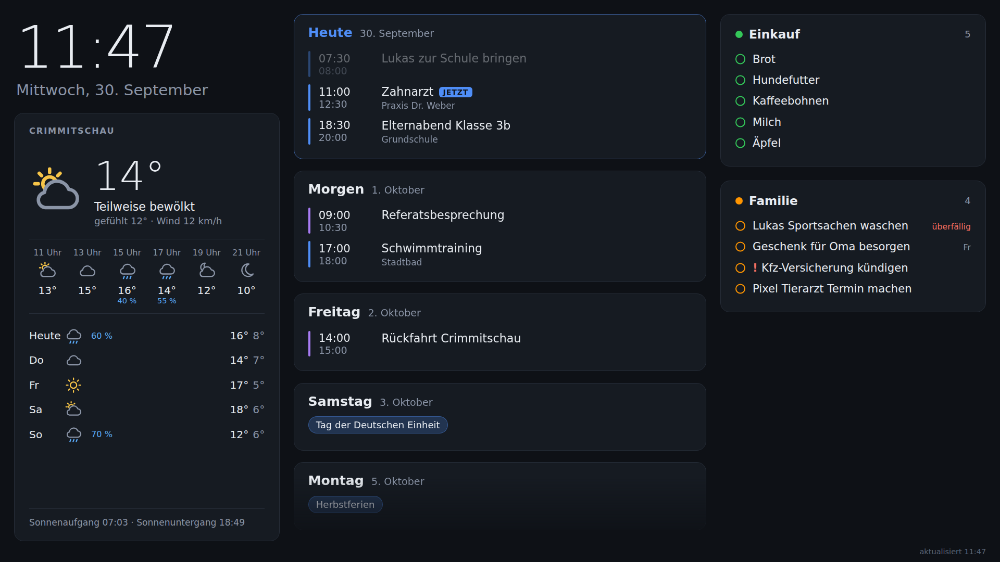

# familydash

A lightweight family wall dashboard: **Google Calendar**, **weather**, the **school timetable** from beste.schule and the **Bring! shopping list**, the **school lunch** ordered at VielfaltMenü and today's **Things 3 to-dos** on one screen.
Runs as a static Go binary in a ~20 MB container on Unraid; a Raspberry Pi only runs a browser in kiosk mode.



- Go standard library only — no dependencies, no database, no Node build step
- The image also ships the [things3](https://github.com/evanpurkhiser/things3-cloud) CLI (Rust, MIT) for the Things card
- Frontend is plain HTML/CSS/JS, embedded in the binary
- Reloads itself on the wall display when you deploy a new image
- Keeps the last good data per source, so a flaky feed never blanks the screen

```
 Google Calendar ──(iCal secret URL, 5 min)──┐
 Open-Meteo      ──(15 min)──────────────────┤
 beste.schule    ──(API token, 15 min)───────┼──▶ familydash (Unraid, :8080) ◀── Chromium kiosk (Raspberry Pi)
 Bring!          ──(login, 2 min)────────────┤
 VielfaltMenü    ──(login per child, 30 min)─┤
 Things Cloud    ──(things3 CLI, 5 min)──────┘
```

## Quick start (Unraid)

1. Every push to `main` builds `ghcr.io/mmeister86/familydash` (amd64 + arm64) via GitHub Actions.
2. **Either** copy `deploy/unraid/my-familydash.xml` to `/boot/config/plugins/dockerMan/templates-user/` and add the container via *Docker → Add Container*,
   **or** use the Compose Manager plugin with `docker-compose.yml` + `.env` (see `.env.example`).
3. Open `http://<unraid-ip>:8080`.

## Configuration

All settings are environment variables.

| Variable | Default | |
|---|---|---|
| `TZ` | `Europe/Berlin` | Display time zone |
| `CALENDAR_n_URL` | – | iCal URL, `n` = 1…20. `webcal://` is accepted |
| `CALENDAR_n_NAME` | `Kalender n` | |
| `CALENDAR_n_COLOR` | palette | Hex color for bars/chips |
| `CALENDAR_n_PANEL` | `column` | `column` = own column in the calendar row, `school` = card next to beste.schule (next 3 weeks) |
| `CALENDAR_n_COLUMN` | – | Number `m` of another calendar: show this one **inside calendar m's column** instead of its own (entries keep their own color), e.g. public holidays in the family column |
| `CALENDAR_DAYS` | `7` | Days shown (today + n-1) |
| `CALENDAR_REFRESH` | `5m` | Go duration |
| `WEATHER_LAT` / `WEATHER_LON` | – | Weather is off until set |
| `WEATHER_NAME` | – | Label above the weather panel |
| `WEATHER_REFRESH` | `15m` | |
| `BESTESCHULE_TOKEN` | – | Personal Access Token; school panel is off until set |
| `BESTESCHULE_STUDENTS` | all | Comma-separated first names or ids to show |
| `BESTESCHULE_REFRESH` | `15m` | |
| `BESTESCHULE_URL` | `https://beste.schule/api` | |
| `WASTE_n_NAME` | – | Bin name, `n` = 1…10, e.g. `Gelbe Tonne`; waste chips are off until set |
| `WASTE_n_DAY` | – | Collection weekday: `Mo` … `So` (also `mittwochs`, `Wed`) |
| `WASTE_n_WEEKS` | every week | `gerade` / `ungerade` ISO calendar week, or `jede` |
| `WASTE_n_COLOR` | grey, yellow, blue … | Dot color |
| `WASTE_HOLIDAY_SHIFT` | `on` | Move a collection one day later per weekday public holiday (Saxony) earlier in the same week; `off` to disable |
| `TIMETABLE_FILE` | built-in | Path to a JSON timetable (see *Fixed timetable*); `off` disables it |
| `BRING_EMAIL` / `BRING_PASSWORD` | – | Bring! account; shopping panel is off until set |
| `BRING_LIST` | account default | Name of the list to show, e.g. `Zuhause` |
| `BRING_LOCALE` | `de-DE` | Language for catalog item names |
| `BRING_REFRESH` | `2m` | |
| `VIELFALT_n_USER` / `VIELFALT_n_PASSWORD` | – | VielfaltMenü login (Kundennummer + password) of child `n` = 1…6; lunch cards are off until set |
| `VIELFALT_n_NAME` | name from the portal | Card title, e.g. `Lukas` |
| `SCENE_MORNING` … `SCENE_NIGHT` | `06:45`, `09:00` (DAY), `14:00` (AFTERNOON), `19:00` (EVENING), `21:30` (NIGHT) | Start of each time-of-day layout on school days (Mon–Fri); `off` skips a scene |
| `SCENE_<NAME>_WEEKEND` | MORNING `07:30`, DAY `10:00`, rest = school-day value | Same for Saturday/Sunday |
| `SCENE_FORCE` | – | Always show this scene (`morning`, `day`, `afternoon`, `evening`, `night`) – for testing |
| `PHOTOS_DIR` | `/data/pictures` | Folder with photos for the slideshow (subfolders ok); `off` disables it. May not exist yet – it's picked up once it does |
| `PHOTOS_INTERVAL` | `45s` | Time per photo |
| `PHOTOS_SHUFFLE` | `on` | Random order; `off` = alphabetical |
| `PHOTOS_REFRESH` | `5m` | How often the folder is rescanned |
| `NIGHT_BG` | `/data/bg.jpeg` (also `bg.jpg`, `.png`, `.webp`) | Full-screen picture behind the night clock; `off` = plain black. Replaced files show up with the next poll |
| `WEATHER_BG_DIR` | `/data/wetter` | Folder with weather pictures behind the clock/weather card (see *Weather pictures*); `off` = gradients only |
| `NEWS_LOCAL` | – | Comma-separated Google News searches shown together as the first news group, e.g. `Crimmitschau,Landkreis Zwickau` |
| `NEWS_LOCAL_NAME` | `Region` | Title of that group |
| `NEWS_LOCAL_DAYS` | `2` | Only articles from the last n days (Google `when:` filter – small towns otherwise bring up years-old stories) |
| `NEWS_TOP` | `on` | Google News top stories for Germany as the second group (`NEWS_TOP_NAME`, default `Deutschland`); `off` to drop it |
| `NEWS_n_URL` / `NEWS_n_NAME` | – | Up to 5 more RSS feeds, e.g. `https://www.tagesschau.de/index~rss2.xml` |
| `NEWS` | `on` | `off` hides the news card completely |
| `NEWS_REFRESH` / `NEWS_MAX_AGE` / `NEWS_PER_GROUP` | `20m` / `48h` / `12` | Polling (stay ≥ 15 min, Google rate-limits), oldest headline, headlines per group |
| `VIELFALT_n_COLOR` | palette | Dot color of the card |
| `VIELFALT_REFRESH` | `30m` | |
| `THINGS_EMAIL` / `THINGS_PASSWORD` | – | Things Cloud account; children's to-dos are off until set |
| `THINGS_AREA` | `Familie` | Things area whose **Today** to-dos are shown (title, case-insensitive substring) |
| `THINGS_REFRESH` | `5m` | |
| `THINGS_STATE_DIR` | `/data/things` | Sync cache of the CLI; falls back to `/tmp` when not writable (then it syncs from scratch after a restart) |
| `UPTIME_URL` | – | Uptime Kuma **status page** URL, e.g. `http://192.168.188.127:3001/status/dashboard`; footer status is off until set |
| `UPTIME_API_KEY` | – | Optional Kuma API key (Settings → API Keys): reads `/metrics` for TLS certificate expiry |
| `UPTIME_CERT_WARN_DAYS` | `14` | Footer warns when a certificate has this many days left or fewer |
| `UPTIME_REFRESH` | `1m` | |
| `LISTEN_ADDR` | `:8080` | |

Values may be wrapped in quotes (`KEY="value"`) – they are stripped, since `docker --env-file` would otherwise keep them.

### Layout

Built for a **portrait** wall display. Every time-of-day scene has its own layout (see *Time-of-day scenes*); the calendars always fill the bottom row:

```
morning                         day / afternoon                 evening
┌─────────────┬─────────────┐   ┌─────────────┬─────────────┐   ┌─────────────┬─────────────┐
│ clock       │ weather pic │   │ clock+wx pic│ Bring! list │   │ clock       │ weather pic │
├─────────────┼─────────────┤   ├─────────────┼─────────────┤   ├─────────────┼─────────────┤
│ timetable 1 │ Bring! list │   │ day: photos │ day: news   │   │ photos      │ timetable 1 │
│ ─────────── ├─────────────┤   │ afternoon:  │ afternoon:  │   │             │ + lunch     │
│ timetable 2 │ news        │   │ child 1     │ child 2     │   │             │ timetable 2 │
├────────┬────┴───┬─────────┤   ├────────┬────┴───┬─────────┤   ├────────┬────┴───┬─────────┤
│ cal 1  │ cal 2  │ cal 3 … │   │ cal 1  │ cal 2  │ cal 3 … │   │ cal 1  │ cal 2  │ cal 3 … │
└────────┴────────┴─────────┘   └────────┴────────┴─────────┘   └────────┴────────┴─────────┘
```

A section with nothing to show (no photos, no news configured …) hands its space to its neighbour.

For a child without beste.schule, keep their school dates in a Google calendar and set `CALENDAR_n_PANEL=school`.

**One card per child** (afternoon): a `CALENDAR_n_PANEL=school` calendar and a `VIELFALT_n_*` lunch account whose name matches a child's card
(beste.schule or fixed timetable) move into that card, ordered *school → To-dos → Termine → Essen*. Morning and evening show only
the timetables, stacked in one card (evening: plus the next lunch). Names match case-insensitively, and a
single first name also matches a full name (`Lukas` ↔ `Meister Lukas`). Anything without a matching child keeps a card of its own.

### Waste collection

For districts that only publish a printable plan ("mittwochs gerade Kalenderwoche"): one `WASTE_n_*` set per bin.
The clock card shows a chip for each bin collected **tomorrow** (put it out tonight) – nothing otherwise.
Holiday shifts follow the common rule (Saxon public holidays, +1 day per holiday on or before the collection day in that week) –
check it against your district's announcements around holidays.

### Fixed timetable (school without beste.schule)

`internal/timetable/stundenplan.json` holds a weekly plan that is compiled into the image and shows up as the same card as a beste.schule child:
lesson times, subjects per weekday (`""` = free period, `{"A": "Werken", "B": "Kunst"}` = alternating weekly, counted from `weekA`), extras such as afternoon clubs (`"tag": "GTA"`) and holidays (`noSchool`).
It switches to the next school day after the last lesson, like beste.schule. With `"calendar": "<name>"` the upcoming entries of the
`CALENDAR_n_PANEL=school` calendar with that name appear at the bottom of the card instead of in a card of their own.
Edit the file and push, or mount your own and point `TIMETABLE_FILE` at it.

To show two calendars in one column, point the second one at the first: `CALENDAR_5_COLUMN=1` puts calendar 5 into calendar 1's column.
Good for a holiday feed next to the family calendar, e.g. `https://www.feiertage-deutschland.de/kalender-download/ics/feiertage-deutschland.ics`.

### Google Calendar

Google Calendar (web) → ⚙ Settings → pick the calendar → **Integrate calendar** → *Secret address in iCal format*.
Paste that into `CALENDAR_1_URL`. One variable per calendar (family, school, work…).
No OAuth, no Google Cloud project. Treat the URL like a password.

The parser handles what Google/iCloud/Outlook export in practice: time zones, all-day and multi-day events,
`RRULE` (daily/weekly/monthly/yearly, `INTERVAL`, `COUNT`, `UNTIL`, `BYDAY` incl. `2TU`/`-1FR`, `BYMONTHDAY`, `BYMONTH`, `BYSETPOS`),
`EXDATE`, moved/cancelled single instances (`RECURRENCE-ID`) and DST changes. See `internal/calendar/ics_test.go`.

Note: Google refreshes the secret iCal feed itself only every few minutes to hours; that delay is on Google's side.

### beste.schule

beste.schule → user menu (top right) → **API** → create a *Personal Access Token* → `BESTESCHULE_TOKEN`.
Works with a parent account; each child gets its own card.

Per child the dashboard shows:

- **Timetable** for today while school is running, afterwards for the next school day (weekends, holidays and `no_school_dates` are skipped)
- **Cancellations and substitutions** from the substitution plan inline (struck through / "Vertretung", incl. room changes) plus day notices
- **Exams** (Klassenarbeit, Leistungskontrolle, Test …) for the next 3 weeks and **homework** for the next 2 weeks from the class journal

The beste.schule API returns nested, loosely structured data, so the parser is deliberately tolerant
(modelled on the Home Assistant integration [RF1705/beste-schule](https://github.com/RF1705/beste-schule)).
If something looks wrong for your school, inspect what the API returns:

```sh
docker exec familydash /familydash -besteschule-preview   # what the dashboard would show
docker exec familydash /familydash -besteschule-dump      # raw API responses (contains personal data!)
```

### Bring!

Set `BRING_EMAIL`, `BRING_PASSWORD` and optionally `BRING_LIST`. This needs a classic e-mail/password login –
if you sign in to Bring! with Apple/Google only, the login will fail.

Bring! has **no public API** – this uses the endpoints of the Bring! apps as documented by the community
library [bring-api](https://github.com/miaucl/bring-api) (also used by Home Assistant). It may break when Bring! changes something;
only the shopping panel is affected then.

### VielfaltMenü (school lunch)

Set `VIELFALT_1_USER` (Kundennummer), `VIELFALT_1_PASSWORD` and `VIELFALT_1_NAME`, then the same with `_2_` for the next child.
Each child has its own portal account. Per child the card shows the next two delivery days (today until 14:00, then from tomorrow on):
the ordered dish (sides after `|` in small print) or **"Noch nichts bestellt!"** in orange when a day with menus has no order yet.

There is **no public API** – this logs in like the parent portal (`POST bestellung.vielfaltmenue.com/frontend/login` → token)
and reads the week plan HTML (`GET ibs.vielfaltmenue.com/…/Mealplan/Weekplan?year=…&week=…`); a menu counts as ordered when its
button has `data-quantity-ordered` ≥ 1. It may break when the portal changes; only the lunch cards are affected then. Check the logins with:

```sh
docker exec familydash /familydash -vielfalt-preview
```

### Things 3 (to-dos)

Put the family's to-dos into one Things area (default `Familie`) and set `THINGS_EMAIL` / `THINGS_PASSWORD`
(your Things Cloud login). **To-dos for a child** show up in that child's card in the afternoon (school → To-dos → Termine → Essen):
give the task the child's name as a Things **tag** (`Lukas`) or start the title with it (`Lukas: Zimmer aufräumen` – the prefix is
dropped in the card). Names match like everywhere else (`Lukas` = `Meister Lukas`). Only what's in **Today** counts – in Things' order,
„This Evening" last with a 🌙 – plus what was ticked off today, struck through. Deadlines today or overdue get a red tag.

The scenes since 2026-10 have no general to-do card; tasks without a child's name aren't shown.

Things has **no public API**. The image ships [things3](https://github.com/evanpurkhiser/things3-cloud), a CLI that syncs with
Things Cloud like the apps do (reverse-engineered, pinned to a release in the `Dockerfile`). It may break when Cultured Code changes
something; only the children's to-dos are affected then. familydash only runs fixed, **read-only** commands (`find --json`) and never starts
the CLI's built-in webserver, which would accept any command – including edits – from the network. The CLI keeps a sync cache
(task titles, no password) in `THINGS_STATE_DIR`; with `-v /mnt/user/appdata/familydash:/data` that folder must be writable for
`nobody:users` (`chown 99:100`), otherwise it lives in `/tmp` until the next restart. Check the login and area with:

```sh
docker exec familydash /familydash -things-preview
```

### Time-of-day scenes

The board changes its layout with the time of day:

| Scene | Default (school day) | Shows (besides clock, weather and calendars) |
|---|---|---|
| `morning` | 06:45 | Timetables of all children in one card, Bring!, news. Weather tips for the way to school („Regenjacke mitnehmen") on school days |
| `day` | 09:00 | Bring!, photo slideshow, news |
| `afternoon` | 14:00 | Bring!, one complete card per child (school, to-dos, Termine, lunch) |
| `evening` | 19:00 | Photo slideshow, tomorrow's timetables + lunch in one card |
| `night` | 21:30 | Everything hidden – only a dimmed clock, date and current weather (icon + temperature), on black or on the `NIGHT_BG` picture |

Morning and evening put the clock on the left and the weather (with its picture) on the right, across the full width;
day and afternoon use a compact card with the picture behind clock and weather.

Try a scene on your laptop with `http://<unraid-ip>:8095/?scene=evening`. Scenes and their sections are defined in `SCENES` in
`web/static/app.js`, the grid of each scene in `.board.scene-*` in `style.css`.

### Weather pictures

The clock/weather card shows a picture matching the current weather. Without pictures it paints a gradient per condition; to use
photos, put JPEGs into the weather folder – with `-v /mnt/user/appdata/familydash:/data` that's `/mnt/user/appdata/familydash/wetter`:

| File | Shown for |
|---|---|
| `klar.jpg` | clear sky |
| `heiter.jpg` | sunny with some clouds |
| `bewoelkt.jpg` | overcast |
| `nebel.jpg` | fog |
| `regen.jpg` | drizzle, rain, showers |
| `schnee.jpg` | snow, sleet |
| `gewitter.jpg` | thunderstorm |
| `nacht.jpg` | any weather while it's dark |
| `standard.jpg` | anything without a picture of its own |

Optional night variants: `<name>-nacht.jpg`, e.g. `regen-nacht.jpg`. Lookup order at night: `regen-nacht` → `nacht` → `regen` → `standard`;
by day: `regen` → `standard`; then the gradient. Lowercase names without umlauts; `.jpeg`, `.webp` and `.png` work too.
About 1600 px wide and under 500 KB is plenty. The picture is darkened for legible text – calm skies work best. New files show up with the next poll.

### News

Headlines only (title, source, age) – the display has no touch. With `NEWS_LOCAL=Crimmitschau,Landkreis Zwickau` the card shows a
*Region* group (both searches merged, duplicates removed) above Germany's top stories. Google News RSS is unofficial but has been stable
for years; if it ever goes away, `NEWS_TOP=off` plus `NEWS_1_URL=https://www.tagesschau.de/index~rss2.xml` is a drop-in.

### Photos

Put JPEG/PNG/WebP files into the photo folder – subfolders are fine, new files show up within `PHOTOS_REFRESH`.
With the default `PHOTOS_DIR=/data/pictures` and the container started with `-v /mnt/user/appdata/familydash:/data`, that's `/mnt/user/appdata/familydash/pictures` on Unraid.

- **HEIC (iPhone default) can't be shown by the browser** – export as JPEG or set the iPhone camera to *Most Compatible*.
- Keep files reasonably small (≈ 2–4 MP is plenty for the wall); the Pi downloads each one once and caches it.
- Hidden files (macOS `._*` from SMB copies, `@eaDir`) are ignored.

### Night background

Drop a picture as `bg.jpeg` into the data folder – with `-v /mnt/user/appdata/familydash:/data` that's `/mnt/user/appdata/familydash/bg.jpeg` on Unraid. The night scene then shows it full-screen (anchored at the bottom, so a horizon stays in view) with the clock in the upper third. Pick something dark – it's on all night. Without the file the clock stays on black. Don't put it into the photo folder, or it joins the slideshow.

### Uptime Kuma (footer)

Create a status page in Uptime Kuma and put the monitors the wall should know about on it (e.g. *Internet* = ping `1.1.1.1`, *Jellyfin*, mail).
Set `UPTIME_URL` to that page. familydash reads Kuma's public status page JSON – no login needed:

```sh
curl http://192.168.188.127:3001/api/status-page/dashboard            # monitors
curl http://192.168.188.127:3001/api/status-page/heartbeat/dashboard  # heartbeats + 24 h uptime
```

The footer stays quiet while everything is up (a green „Alle 4 Dienste laufen"). A monitor that is **down** turns the footer red
and taller: „Jellyfin ausgefallen seit 14 min". Pending (retrying) monitors, maintenance and a pinned incident show up in yellow/blue.
With `UPTIME_API_KEY` set, certificates of the monitors on the page that expire within `UPTIME_CERT_WARN_DAYS` show a 🔒 warning.

Tip: add a *Push* monitor in Kuma and let the Pi call its URL every minute (cron + `curl`) – then Kuma tells you when the wall display itself hangs.

### Weather

[Open-Meteo](https://open-meteo.com) — free, no API key, uses DWD's ICON model for Germany.

## Raspberry Pi (display)

Raspberry Pi OS (Desktop). Add to `~/.config/labwc/autostart`:

```sh
chromium --kiosk --noerrdialogs --disable-infobars --incognito --check-for-update-interval=31536000 http://<unraid-ip>:8080 &
```

Disable screen blanking via `sudo raspi-config` → *Display Options* → *Screen Blanking*.
Set the Pi's time zone to `Europe/Berlin` – the frontend groups days by the browser's local time.
At night (`SCENE_NIGHT`) the page shows only a dimmed clock. Portrait and landscape both work.

## API

| | |
|---|---|
| `GET /api/dashboard` | Everything the frontend needs (JSON), incl. `uptime` |
| `GET /photos/<path>` | Slideshow files (only those listed in `/api/dashboard`) |
| `GET /healthz` | Liveness |

## Development

```sh
go test ./...
cp .env.example .env   # fill in
set -a; . ./.env; set +a; go run ./cmd/familydash
```

Frontend: edit `web/static/*`, restart the binary (files are embedded).

## Roadmap

See [docs/ROADMAP.md](docs/ROADMAP.md) – incl. voice control with Parakeet.
